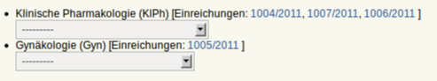

======================================
Nächste Sitzung: Spezialistenzuordnung
======================================

In der Einstufung und Zuteilung wurden die Studien bestimmten medizinischen Kategorien zugeordnet. In der Spezialistenzuordnung können Sie nun auswählen, welche/r Spezialist/in für eine bestimmte medizinische Kategorie in dieser Sitzung zuständig sein soll.

Mit einem Klick auf die Dropdown-Liste öffnet sich ein Auswahlfeld. Wählen Sie die benötigten Spezialist/innen aus.

Klicken Sie auf den Studiennummern-Link, um zur schreibgeschützten Ansicht zu gelangen.