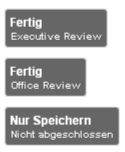

======
delete
======

Der *Sitzungsassistent* ist Ihr permanenter Begleiter im Zeitraum der Sitzung.

Navigation
++++++++++

 * Klicken Sie auf *Sitzung starten*. Das Starten der Sitzung kann nicht rückgängig gemacht werden.

 * Um allgemeine Anmerkungen zur Sitzung zu notieren, klicken Sie auf *Kommentare*. Bestätigen Sie mit *Speichern und Zurück*.

  **bad image reference: 'assistentnavigation'**

  * Wechseln Sie mit einem Klick die Tagesordnungspunkte. Die Suche bietet Ihnen die Möglichkeit, einen Tagesordnungspunkt schnell zu finden.

  * Sobald alle Tagesordnungspunkte abgeschlossen sind, können Sie auf *Sitzung beenden* klicken.

Tagesordnungspunkt ohne Studienbezug
++++++++++++++++++++++++++++++++++++

Beenden Sie den Tagesordnungspunkt mit einem Klick auf *Fertig*.

Tagesordnungspunkt mit Studienbezug
+++++++++++++++++++++++++++++++++++

Ein positives Gutachten ist gekennzeichet durch einen grünen Button, ein negatives durch einen roten Button. Mittels eines Klicks auf den Button Ihrer Wahl erscheint das Kommentar des Sitzungsmitgliedes im Kommentarfeld.

Votum
=====

**bad image reference: 'assistentvotum'**

Tragen Sie das Ergebnis der Abstimmung ein.

Leeres Feld (Kommentarfeld)
===========================

Sie können in das leere Feld ein Kommentar zum Votum eintragen.

Fertig
======

Schließen Sie entweder den Tagesordnungspunkt ab, indem Sie auf den zutreffenden *Fertig*-Button klicken, oder wählen Sie *Nur Speichern*, um später zu diesem Tagesordnungspunkt zurückzukehren.

