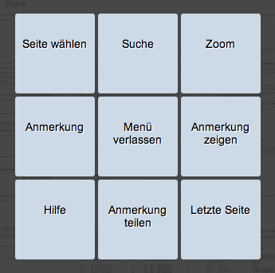

==============
PDF-Betrachter
==============

Diese Hilfe-Seite gibt Ihnen eine Übersicht über die Möglichkeiten des PDF-Betrachters.

Menü
++++

Das Menü des PDF-Betrachters erreichen Sie, indem Sie auf die blaue Kopfzeile klicken. Diese befindet sich im oberen Teil der PDF-Seite und beinhaltet den Titel der Unterlage, die dazugehörige Studiennummer, die Versionsbezeichnung, sowie das Datum der Dokumentenerstellung. Sie können über die Menüpunkte den Anmerkungs-Modus starten, zu einzelnen Seiten springen, die Zoom-Einstellung ändern, nach einer bestimmten Seite suchen, sowie die Hilfe-Seite aufrufen. Wollen Sie aus dem Menüprogramm aussteigen, klicken Sie auf *Beenden*.

Zoom
====

Wann immer Sie ein Dokument zur besseren Lesbarkeit vergrößert oder zum besseren Überblick verkleinert haben wollen, können Sie das durch die *Zoom*-Option tun. Klicken Sie dafür im Menü auf *Zoom*.

Suche
=====

Zum schnellen Auffinden von bestimmten Stellen im Dokument können Sie die Volltextrecherche nutzen. Wählen Sie dafür im Menü die *Suche*-Funktion und geben Sie ein oder mehrere im Text vorkommende, nebeneinanderstehende Worte in das Eingabefeld ein. Klicken Sie dann auf *Suche*. Die Ergebnisse werden in einer Liste präsentiert.

Seite wechseln
==============

Wenn Sie auf den linken oder rechten Rand einer Seite klicken, gelangen Sie auf die vorherige oder nächste Seite. Sie können auch im Menü auf *Seite wählen* klicken und eine bestimmte Seitenzahl angeben. Der Menüpunkt *Letzte Seite* zeigt Ihnen die letzte Seite des Dokuments an.

**Die folgenden Funktionen werden nur bestimmten Gruppen des Systems zur Verfügung gestellt.**

Anmerkungs-Modus
================

Wenn Sie sich Notizen zu einer Stelle im Dokument machen wollen, können Sie das über den Anmerkungs-Modus machen.

Um in den Anmerkungs-Modus zu gelangen, klicken Sie im Menü auf *Anmerkung*. Markieren Sie dann mit dem Mauszeiger eine beliebige Stelle. Um das markierte Feld zu vergrößern/verkleinern, ziehen Sie an dem kleinen roten Quadrat rechts unten innerhalb der Markierung. Nach der Markierung poppt automatisch ein Fenster auf, in das Sie Ihre Notizen eintragen können.

Sie haben die Möglichkeit, alle Anmerkungen dieses PDF's durchzusehen. Klicken Sie dafür auf den linken oder rechten Pfeil innerhalb des Fensters.

Sie können die Anmerkung speichern, löschen oder den Anmerkungsmodus abbrechen. Zudem entsteht nach der Markierung automatisch eine Schaltfläche am rechten Rand der PDF-Seite. Wenn Sie auf diese Schaltfläche klicken, öffnet sich das Anmerkungsfenster. Es lässt sich aber ebenso mit einem Doppelklick auf die Markierung öffnen.

Mit einem erneuten Klick auf den Menüpunkt *Anmerkung* oder über den Punkt *Beenden* können Sie aus dem Modus aussteigen.

Anmerkung teilen
================

Es besteht die Möglichkeit, Ihre Anmerkungen mit einem/einer anderen Benutzer/in des Systems teilen.

 Klicken Sie dafür im Menü auf das Schaltfeld *Anmerkung teilen*. Dadurch öffnet sich eine Liste der Anmerkungen, die Sie in diesem Dokument eingefügt haben. Schreiben Sie die E-Mailadresse der betreffenden Benutzerin in das Eingabefeld und wählen Sie die Anmerkungen mit einem Klick in die betreffende Checkbox/en aus. Klicken Sie danach auf *Teilen*.

Nachdem die von Ihnen ausgewählte Person eine Nachricht erhalten hat, dass Sie Ihre Anmerkungen mit ihr teilen, kann sie in die Anmerkungen einsehen.

Benutzung mit einem Tablet
++++++++++++++++++++++++++

Der PDF-Betrachter ist, zusätzlich zur Benutzung mit einem normalen PC, auch speziell angepasst für 10 Zoll Android3 Tablets.

