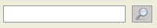

=============
Alle Studien
=============

**Diese Funktion wird nur bestimmten Benutzer/innen des Systems zur Verfügung gestellt.**

Je nachdem, wie Sie auf diese Seite gelangt sind, setzt sich der Inhalt dieser Liste unterschiedlich zusammen:

* Sind Sie über den Menüunterpunkt *Alle Studien* hierher gelangt, werden Ihnen alle verfügbaren Studien (eingereichte und neue) aufgelistet.

* Sind Sie über die Suchfunktion im Seitenmenü hierher gelangt, wird Ihnen nur jene Auswahl an Studien aufgelistet, die Ihren Suchkriterien entspricht.

Filter
++++++

Für die Sortierung der Studien werden mehrere Filter zur Verfügung gestellt. Die erste Zeile zeigt Ihnen alle Studien an, die noch keiner Sitzung zugeordnet sind (*Neu*), die in die nächste Sitzung kommen (*Nächste Sitzung*) und jene Studien, die in anderen Sitzungen sind (*Andere Sitzungen*). Die zweite Zeile erlaubt Ihnen, die angezeigten Sitzungszuordnungen nach bestimmten Studien (*AMG*, *MPG*, *Diplomarbeit*, *Andere*) zu filtern. In der dritten Zeile können Sie Studien nach ihrem Votum filtern und die vierte Zeile ermöglicht Ihnen, zwischen *Meine*, *Übernommene* und *Andere Studien* zu wählen.

Standardmäßig sind alle Filter aktiv. Wenn Sie einen Filter deaktivieren, werden Ihnen Studien dieser Kategorie nicht angezeigt.

Studie ansehen
++++++++++++++

Mittels Studiennummern-Links können Sie eine beliebige Leseansicht einer Studie öffnen. Nähere Erläuterungen zur Studien-Leseansicht finden Sie auf der Hilfe-Seite :doc:`core.readonly_submission`.

Sitzung ansehen
+++++++++++++++

Sitzungs-Links führen Sie zur Zeitplanung, die Ihnen eine Übersicht über alle Tagesordnungspunkte einer Sitzung gibt. Weitere Informationen dazu finden Sie in der Hilfe-Seite :doc:`meetings.timetable_editor`.

PDF-Herunterladen der Studie
++++++++++++++++++++++++++++

Sie haben die Möglichkeit, die Leseansicht der Studie als PDF herunterzuladen.

